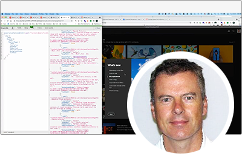

# Adobe Developers Live {#overview}

Adobe Developers Live riunisce sviluppatori di Adobe e creatori di esperienze con background diversi e un unico scopo: creare esperienze end-to-end incredibili. Questa conferenza di due giorni sarà caratterizzata da importanti aggiornamenti per gli sviluppatori, sessioni tecniche e opportunità di networking per la community.

I team dei prodotti di Adobe di Adobe Experience Cloud, Document Cloud e Creative Cloud presenteranno i progressi tecnologici e gli strumenti per sviluppatori più recenti che supportano la progettazione, i flussi di lavoro per la creazione di contenuti, i servizi di documentazione e la gestione dell’esperienza dei clienti nei diversi settori.

Registrati per gli eventi futuri **[qui](https://developerevents.adobe.com/)**.

>[!TIP]
>
>**Tutte le sessioni registrate sono elencate nella barra di navigazione a sinistra**.

## Ottobre 2021

I team di Adobi di prodotto di Adobe Experience Cloud, Document Cloud e Creative Cloud hanno mostrato i progressi tecnologici e gli strumenti per sviluppatori più recenti che supportano la progettazione, i flussi di lavoro per la creazione di contenuti, i servizi di documentazione e la gestione dell’esperienza dei clienti nei diversi settori.

Scopri tutte le altre [sessioni](2021/october/overview.md) !

<table>
  <tr>
   <td>
      
      

         <a href="2021/october/headless.md"><strong>Siti headless</strong></a>         
          <em>con Mathias Siegl, Principal Product Manager, AEM Sites</em>
      

      

         
         Con GraphQL per frammenti di contenuto disponibile per AEM 6.5 e Adobe Experience Manager as a Cloud Service, esploriamo come Adobe Experience Manager può essere utilizzato come CMS headless.
      

     </td>   
     <td>
      
      

         <a href="2021/october/aep-integration.md"><strong>Panoramica dell’integrazione di Adobe Experience Platform</strong></a>
          <em>con Eric Knee, Principal Enterprise Solution Architect</em>
      

      

         
         Questa sessione ti fornirà una panoramica generale dei diversi modi in cui Adobe Experience Platform può integrarsi all’interno del tuo ecosistema e di cose da considerare durante la pianificazione del lavoro di integrazione.
      

   </td>
   </td>
     <td>
      
      

         <a href="2021/october/pdf-services-api.md"><strong>Generazione di documenti e acquisizione di firme elettroniche nelle app tramite l’API di Adobe Sign</strong></a>
          <em>con Ben Vanderberg, Principal Developer evangelist</em>
      

      

         
         Adobe Document Generation API è un potente servizio di creazione di documenti guidato dai modelli di Microsoft Word uniti ai tuoi dati. In combinazione con l’API di Adobe Sign, gli sviluppatori possono generare facilmente documenti dinamici pronti per essere elaborati tramite il flusso di lavoro di firma.
      

   </td> 
  </tr>
</table>

## Febbraio 2021

Questa conferenza di due giorni ha visto importanti aggiornamenti per gli sviluppatori di Adobe Experience Manager, come Headless e GraphQL, Adobe Experience Manager as a Cloud Service, sessioni tecniche e opportunità di networking per la community.

Scopri tutte le altre [sessioni](2021/february/overview.md).

<table>
  <tr>
   <td>
      
      

         <a href="2021/february/headless-graphql-content-fragments.md"><strong>Headless - GraphQL con frammenti di contenuto</strong></a>         
          <em>con Jabran Asghar, Sr. Software Engineer</em>
      

      

         
         Scopri le nuove funzionalità headless con i miglioramenti più recenti relativi ai frammenti di contenuto. Questa sessione si concentrerà sull’API GraphQL per AEM Cloud Service.
      

     </td>   
     <td>
      
      

         <a href="2021/february/rapid-frontend-devlopment.md"><strong>Sviluppo front-end: il tuo flusso di lavoro futuro per creare e distribuire rapidamente il front-end del sito.</strong></a>
          <em>con Gabriel Walt, Sr. Product Manager</em>
      

      

         
         Utilizza i modelli di sito per creare nuovi siti in pochi clic e ridare il tocco dello sviluppo front-end con la rapida distribuzione di risorse front-end come CSS&amp;JS.
      

   </td>
   </td>
     <td>
      
      

         <a href="2021/february/get-ready-aem-cloud.md"><strong>Preparati al Cloud Service: best practice per la migrazione</strong></a>
          <em>con Andreea Moise, Sr. Software Engineer</em>
      

      

         
         Per massimizzare i vantaggi di AEM Cloud Service, è fondamentale adattare la base di codice per renderlo compatibile con il cloud e resistente ai bollettini, in modo da evitare futuri aggiornamenti gestiti dal team.
      

   </td>
  </tr>
</table>
