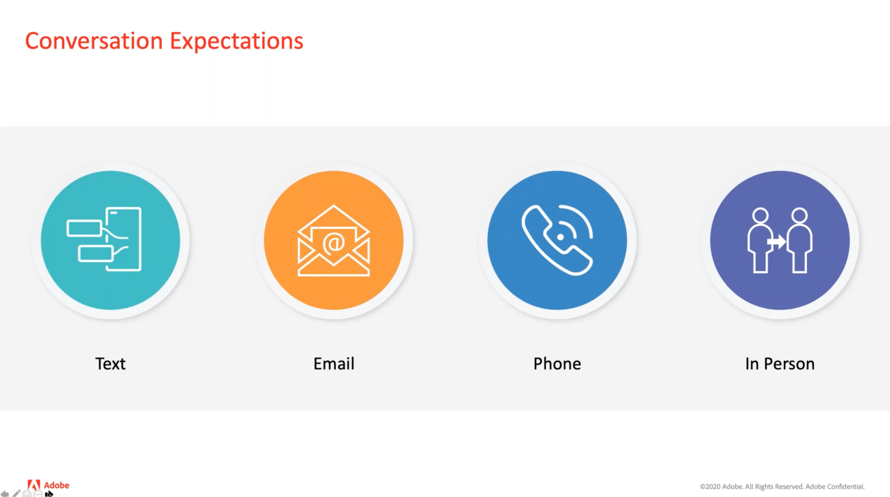
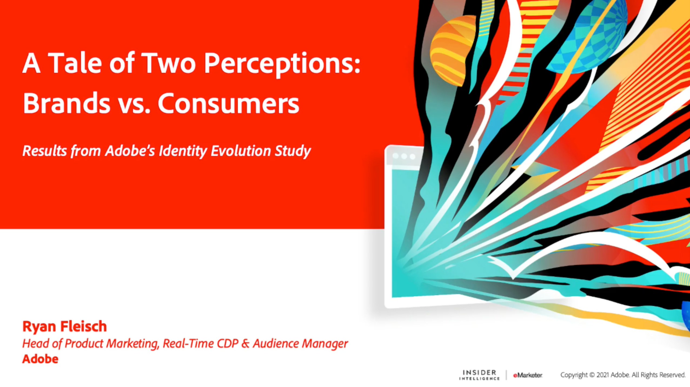

# Customer Data Management - Voices {#overview}

Benvenuti in Customer Data Management Voices come leader e specialista tecnico e di marketing per la gestione dei dati dei clienti. Questa pagina è il punto di riferimento per ascoltare i tuoi colleghi, trarre spunti e scoprire gli sviluppi di martech. Non è richiesta alcuna registrazione, basta fare clic e guardare.

>[!TIP]
>
>**Tutte le sessioni registrate sono elencate nella barra di navigazione a sinistra**.

## Elementi di base per la gestione dei dati dei clienti

<table>
  <tr>
   <td>
      
      

         <a href="./cdm/first-mile.md"><strong>Semplificazione del primo miglio di gestione dei dati</strong></a>
          
      

   </td>
   <td>
      
      

         <a href="./cdm/cdp-success.md"><strong>Selezione di una piattaforma di dati cliente per il successo</strong></a>
          
      

    </td>
    <td>
      
      

         <a href="./cdm/people-and-process.md"><strong>Best practice per CDP: persone e processi</strong></a>
          
      

    </td>
   </tr>
   <tr> 
   <td>
      
      

         <a href="./cdm/evolving-your-audience-center-of-excellence.md"><strong>Evoluzione del centro di eccellenza del pubblico</strong></a>
          
      

    </td>
   <td>
      
      

         <a href="./cdm/building-better-experiences-with-customer-profiles.md"><strong>Creare esperienze migliori con i profili dei clienti</strong></a>
      

      

         
    </td>
   <td>
      
      

         <a href="./cdm/how-marketing-teams-are-improving-data-management-strategies.md"><strong>Come i team di marketing migliorano le strategie di gestione dei dati</strong></a>
      

      

      

    </td>
  </tr>
</table>

## Governance e privacy dei dati di pubblico e profilo

<table>
  <tr>
   <td>
      
      

         <a href="./governance/healthcare-shield.md"><strong>Adobe Real-time Customer Data Platform e Healthcare Shield</strong></a>
          
      

      

         
   </td> 
   <td>
      
      

         <a href="https://experienceleague.adobe.com/docs/platform-learn/tutorials/privacy/ten-considerations-for-responsible-customer-data-management.html"><strong>10 considerazioni sulla gestione responsabile dei dati dei clienti</strong></a>
          
      

      

         
    </td>
    <td>
      
      

         <a href="https://experienceleague.adobe.com/docs/platform-learn/tutorials/privacy/elevating-the-marketers-role-as-a-data-steward.html"><strong>Migliorare il ruolo dell’addetto marketing come amministratore dei dati</strong></a>
          
      

      

         
       

    </td>
  </tr>
</table>

## Discussioni di settore

<table>
  <tr>
     <td>
      
      

         <a href="./industry/build-superb-experiences-with-your-first-party-data.md"><strong>Crea esperienze straordinarie con i dati di prime parti</strong></a>
      

      

      

    </td>
     <td>
      
      

         <a href="./industry/data-collaboration-in-the-first-party-data-context.md"><strong>Collaborazione dei dati nel contesto dei dati di prime parti</strong></a>
      

      

      

    </td>
     <td>
      
      

         <a href="./industry/the-future-of-data-management-and-the-changing-environment.md"><strong>Il futuro della gestione dei dati e l’ambiente in evoluzione</strong></a>
      

      

      

    </td>
   <td>
      
      

         <a href="./industry/brands-vs-consumers.md"><strong>Un racconto di due percezioni: marchi e consumatori</strong></a>
          
      

    </td>
  </tr>
</table>
