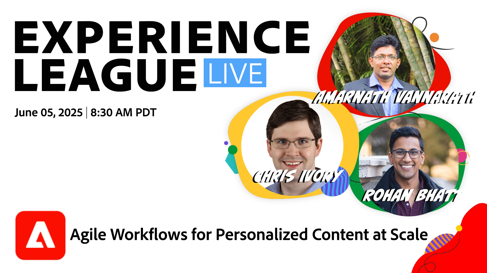

# Experience League LIVE

Experience League LIVE è un evento in diretta in streaming prodotto dal team Experience League.  Offre l’opportunità di entrare in contatto con gli esperti dei prodotti Adobe e imparare suggerimenti, trucchi e strategie da mettere in pratica nelle applicazioni Adobe Experience Cloud.

## Prossimi eventi Experience League LIVE

<table>
    <tr>
        <td style="vertical-align: top;">
            

              <a href="episodes/exl-live-episode-05-22-25.md">
                <strong>Content Analytics: ottimizzazione delle prestazioni con informazioni sull'intelligenza artificiale</strong>
              </a>
               <em>con Shay O'Reilly, Jennifer Werkmeister e Doug Moore</em>
               <em>28 maggio 2025</em>
            

        </td>
        <td style="vertical-align: top;">
            

              <a href="episodes/exl-live-episode-47-2025-06-05.md">
                <strong>Flussi di lavoro Agile per contenuti personalizzati su larga scala</strong>
              </a>
               <em>con Amarnath Vannarath, Chris Ivory e Rohan Bhatt</em>
               <em>5 giugno 2025</em>
            

        </td>
        <td style="vertical-align: top;">
            

              <a href="episodes/exl-live-episode-06-18-25.md">
                <strong>Limitazione frequenza principale e definizione delle priorità per i conflitti</strong>
              </a>
               <em>con Sandra Hausmann, Ariel Sultan, Aaron Forrest e Keara Fausett</em>
               <em>18 giugno 2025</em>
            

        </td>
    </tr>

</table>

## Proposte del nostro staff

<table style="max-width: 1214px;">

<tr>
  <td style="vertical-align: top;">
    

      <a href="episodes/exl-live-episode-06-26-24.md">
        <strong>Come le ultime versioni di Adobe Real-Time CDP possono spostare l'ago per la tua azienda</strong>
      </a>
       <em>con Nina Caruso, Rudi Shumpert e Doug Moore</em>
       <em>26 giugno 2024</em>
    

  </td>

<td style="vertical-align: top;">
    
    

      <a href="episodes/exl-live-episode-05-16-24.md"><strong>Migrazione in corso di Analytics a Web SDK</strong></a>
       <em>con Mitch Rice, Joe Khoury e Doug Moore</em>
       <em>16 maggio 2024</em>
    

  </td>

<td style="vertical-align: top;">
    
    

      <a href="episodes/exl-live-episode-04-24-24.md">
        <strong>Nuovo canale di esperienza basato su codice in Journey Optimizer</strong>
      </a>
       <em>con Sandra Hausmann, Robert Calangiu e Brent Kostak</em>
       <em>24 aprile 2024</em>
    

  </td>
  </tr>

</table>

>[!TIP]
>
>Per ulteriori metodi di apprendimento, consulta i nostri [corsi](https://experienceleague.adobe.com/#dashboard/learning) gratuiti e le singole [esercitazioni](https://experienceleague.adobe.com/docs/home-tutorials.html?lang=it).

