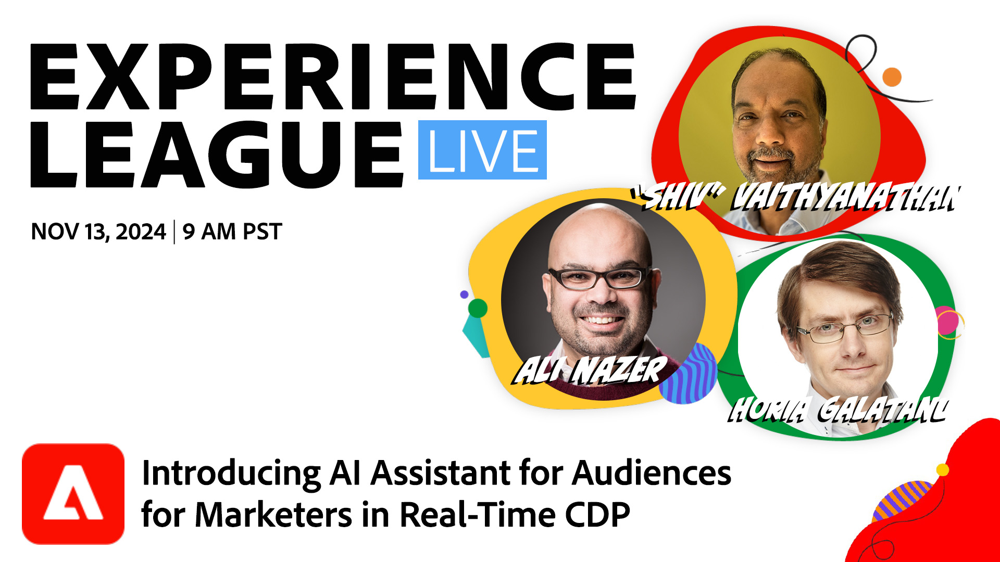

# Experience League LIVE

Experience League LIVE è un evento in diretta in streaming prodotto dal team di Experienci League.  Offre l’opportunità di entrare in contatto con gli esperti dei prodotti Adobe e imparare suggerimenti, trucchi e strategie da mettere in pratica nelle applicazioni Adobe Experience Cloud.

## Prossimi Experienci League di eventi LIVE

<table>
<tr>

<td style="vertical-align: top;">
    

      <a href="episodes/exl-live-episode-11-13-24.md"><strong>Unisciti a noi per un'emozionante sessione dal vivo in cui gli esperti di prodotto e progettazione Adobe ti daranno un'interessante panoramica sulla nostra ultima innovazione rivoluzionaria: IA Assistant for Audiences, disponibile a breve in Adobe Real-Time CDP per sovrascrivere approfondimenti e azioni sul pubblico. </strong></a>
       <em>con Shivakumar Vaithyanathan, Ali Nazer e Horia Galatanu</em>
       <em>13 novembre 2024 alle 9:00 PT</em>
        <a href="https://engage.adobe.com/ExpLeagueLive-241113.html">Registrati per questo evento</a>
    

  </td>
</tr>
</table>

## Proposte del nostro staff

<table style="max-width: 1214px;">

<tr>
  <td style="vertical-align: top;">
    

      <a href="episodes/exl-live-episode-06-26-24.md">
        <strong>Come le ultime versioni di Adobe Real-Time CDP possono spostare l'ago per la tua azienda</strong>
      </a>
       <em>con Nina Caruso, Rudi Shumpert e Doug Moore</em>
       <em>26 giugno 2024</em>
    

  </td>

<td style="vertical-align: top;">
    
    

      <a href="episodes/exl-live-episode-05-16-24.md"><strong>Migrazione in corso di Analytics a Web SDK</strong></a>
       <em>con Mitch Rice, Joe Khoury e Doug Moore</em>
       <em>16 maggio 2024</em>
    

  </td>

<td style="vertical-align: top;">
    
    

      <a href="episodes/exl-live-episode-04-24-24.md">
        <strong>Nuovo canale di esperienza basato su codice in Journey Optimizer</strong>
      </a>
       <em>con Sandra Hausmann, Robert Calangiu e Brent Kostak</em>
       <em>24 aprile 2024</em>
    

  </td>
  </tr>

</table>

>[!TIP]
>
>Per ulteriori metodi di apprendimento, consulta i nostri [corsi](https://experienceleague.adobe.com/#dashboard/learning) gratuiti e le singole [esercitazioni](https://experienceleague.adobe.com/docs/home-tutorials.html?lang=it).
