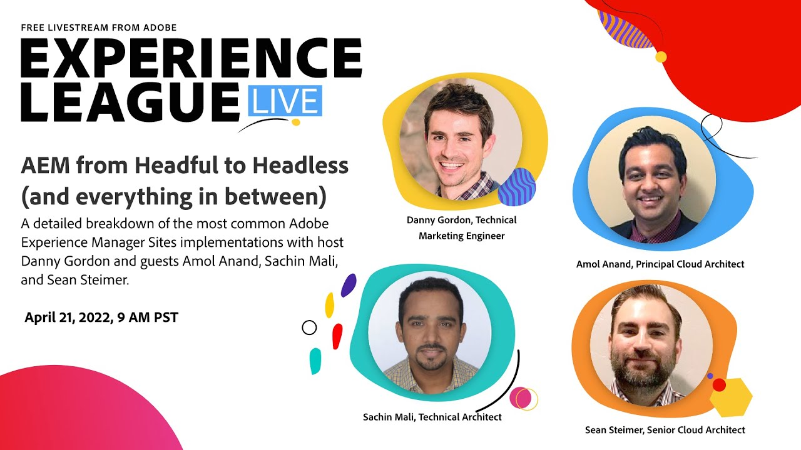

# Experience League LIVE

Experience League LIVE è un evento in diretta prodotto dal team Experience League.  È un’opportunità per entrare in contatto con gli esperti dei prodotti Adobe e imparare suggerimenti, trucchi e strategie da mettere in pratica nelle applicazioni Adobe Experience Cloud.

## Prossimi Experienci League di eventi LIVE

<table>
<tr>
  <td style="vertical-align: top;">
    

      <a href="episodes/exl-live-episode-02-29-24.md">
        <strong>La nuova interfaccia utente di Adobe Campaign Web</strong>
      </a>
       <em>con Sandra Hausmann, Eric Perrin, Gaël Mouëllo, Bruce Swann</em>
       <em>29 febbraio 2024</em>
    

  </td>
</tr>
</table>

## Proposte del nostro staff

<table style="max-width: 1214px;">

<tr>
  <td style="vertical-align: top;">
    

      <a href="/help/experience-league-live/episodes/exl-live-episode-04-21-22.md">
        <strong>AEM da Headful a Headless</strong>
      </a>
       <em>con Danny Gordon, Amol Anand, Sachin Mali e Sean Steimer</em>
       <em>21 aprile 2022</em>
    

  </td>

<td style="vertical-align: top;">
    
    

      <a href="episodes/exl-live-episode-08.md"><strong>Customer Journey Analytics - Scoop interno</strong></a>
       <em>con Trevor Paulsen, Rohit Gossain, Alex Strawn</em>
       <em>25 gennaio 2021</em>
    

  </td>

<td style="vertical-align: top;">
    
    

      <a href="episodes/exl-live-episode-05-26-22.md">
        <strong>Ask the experts: The basics of Web SDK (Domande agli esperti: nozioni di base di Web SDK)</strong>
      </a>
       <em>con Rudi Shumpert, Jeff Chasin ed Eric Matisoff</em>
       <em>26 maggio 2022</em>
    

  </td>
  </tr>

</table>

>[!TIP]
>
>Per ulteriori metodi di apprendimento, consulta i nostri [corsi](https://experienceleague.adobe.com/?lang=it#dashboard/learning) gratuiti e i singoli [tutorial](https://experienceleague.adobe.com/docs/home-tutorials.html?lang=it).
