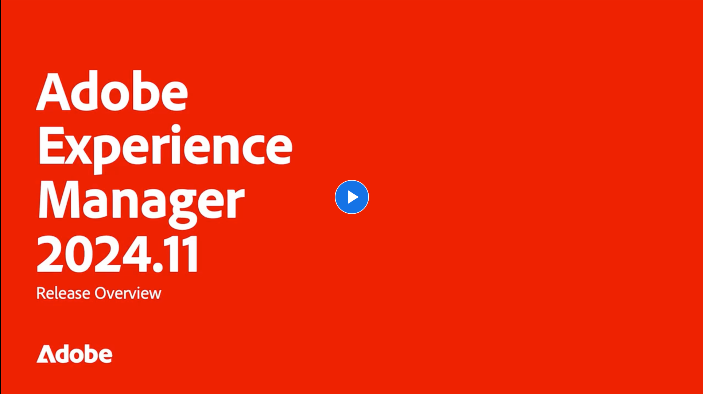

# Aggiornamenti delle versioni di Adobe Experience Manager as a Cloud Service

Veloce panoramica delle funzioni più recenti di Adobe Experience Manager as a Cloud Service. Si tratta di brevi video di circa 10 minuti forniti dal team di prodotto dell’AEM che presentano gli aspetti salienti dell’ultima versione.

## Ultimo aggiornamento

<!-- CARDS

{cta = More details}

* 2024/2024-11-0.md

-->
<!-- START CARDS HTML - DO NOT MODIFY BY HAND -->

    

        

            

                <figure class="image x-is-16by9">
                    
                </figure>
            

            

                

                    

                        <a href="2024/2024-11-0.md" target="_blank" rel="referrer" title="Panoramica sulla versione 2024.11.0 dell’AEM">Panoramica sulla versione AEM 2024.11.0</a>
                    

                    
Questa versione evidenzia gli aggiornamenti chiave per Adobe Experience Manager (AEM) Sites e Assets, tra cui una maggiore estensibilità dell’interfaccia, nuove opzioni di rendering, modificatori di immagini avanzati e miglioramenti ai Edge Delivery Services con l’Editor universale in AEM.

                

                <a href="2024/2024-11-0.md" target="_blank" rel="referrer" class="spectrum-Button spectrum-Button--outline spectrum-Button--primary spectrum-Button--sizeM" style="align-self: flex-start; margin-top: 1rem;">
                    Ulteriori dettagli
                </a>
            

        

    

<!-- END CARDS HTML - DO NOT MODIFY BY HAND -->

## Aggiornamenti precedenti

<!-- CARDS
{cta = More details}

  * 2024/2024-10-0.md
  * 2024/2024-9-0.md
  * 2024/2024-8-0.md
  * 2024/2024-7-0.md
  * 2024/2024-6-0.md
  * 2024/2024-5-0.md
  * 2024/2024-4-0.md
  * 2024/2024-3-0.md
  * 2024/2024-1-0.md
  
-->
<!-- START CARDS HTML - DO NOT MODIFY BY HAND -->

    

        

            

                <figure class="image x-is-16by9">
                    
                </figure>
            

            

                

                    

                        <a href="2024/2024-10-0.md" target="_blank" rel="referrer" title="Panoramica sulla versione 2024.10.0 dell’AEM">Panoramica sulla versione AEM 2024.10.0</a>
                    

                    
Le funzioni di questa versione si concentrano sulle innovazioni di Experience Manager Assets e di Cloud Service e includono:AEM Assets Nuovi prezzi e pacchetti per AEM Assets con Assets Ultimate e Asset PrimeAEM Cloud Service Inoltra i registri a più destinazioni Reindirizzamenti URL senza pipeline per gli utenti aziendali ​ RDE supportano Configurazione delle pipeline YAML​ AEM interattivo Developer Console

                

                <a href="2024/2024-10-0.md" target="_blank" rel="referrer" class="spectrum-Button spectrum-Button--outline spectrum-Button--primary spectrum-Button--sizeM" style="align-self: flex-start; margin-top: 1rem;">
                    Ulteriori dettagli
                </a>
            

        

    

    

        

            

                <figure class="image x-is-16by9">
                    
                </figure>
            

            

                

                    

                        <a href="2024/2024-9-0.md" target="_blank" rel="referrer" title="Panoramica sulla versione 2024.9.0 dell’AEM">Panoramica sulla versione AEM 2024.9.0</a>
                    

                    
Le funzioni di questa versione si concentrano sulle innovazioni Experience Manager Assets e di Cloud Service e includono quanto segue:AEM Assets - Miglioramento del selettore delle risorse per il supporto delle raccolte​ Assets Content Hub - Supporto DRM (risorse scadute e con licenza)​AEM Cloud Service - Supporto Cloud Manager per Edge Delivery​ Edge Side Include (ESI) ​ Autenticazione di base​ Interactive AEM Developer Console

                

                <a href="2024/2024-9-0.md" target="_blank" rel="referrer" class="spectrum-Button spectrum-Button--outline spectrum-Button--primary spectrum-Button--sizeM" style="align-self: flex-start; margin-top: 1rem;">
                    Ulteriori dettagli
                </a>
            

        

    

    

        

            

                <figure class="image x-is-16by9">
                    
                </figure>
            

            

                

                    

                        <a href="2024/2024-8-0.md" target="_blank" rel="referrer" title="Panoramica sulla versione 2024.8.0 dell’AEM">Panoramica sulla versione 2024.8.0 dell'AEM</a>
                    

                    
Le funzioni di questa versione si concentrano sulle innovazioni di AEM Assets e Dynamic Media, Forms, Sites e Cloud Foundation e includono: Dynamic Media Composable Templates for 1:1 dynamic variables Forms GenAI Assistant Universal editor con nuova integrazione della struttura dei contenuti AEM​ Gestisci il ciclo di vita dei certificati DV e il supporto per i Edge Delivery Services tramite Cloud Manager Experience Audit Dashboard Improvements in Pipeline Performance

                

                <a href="2024/2024-8-0.md" target="_blank" rel="referrer" class="spectrum-Button spectrum-Button--outline spectrum-Button--primary spectrum-Button--sizeM" style="align-self: flex-start; margin-top: 1rem;">
                    Ulteriori dettagli
                </a>
            

        

    

    

        

            

                <figure class="image x-is-16by9">
                    
                </figure>
            

            

                

                    

                        <a href="2024/2024-7-0.md" target="_blank" rel="referrer" title="Panoramica sulla versione 2024.7.0 dell’AEM">Panoramica sulla versione 2024.7.0 dell'AEM</a>
                    

                    
Le funzioni di questa versione si concentrano sulle innovazioni di Experience Manager Assets e del Cloud Service e includono quanto segue:AEM Assets:Content credentials in AEM Assets​AI sottotitoli per video con Dynamic Media​Miglioramenti del selettore delle risorse per il caricamento​Cloud Manager:Configurazione self-service di credenziali CDN gestite dal cliente​Pulizia CDN​Avvisi sulle regole del filtro del traffico​

                

                <a href="2024/2024-7-0.md" target="_blank" rel="referrer" class="spectrum-Button spectrum-Button--outline spectrum-Button--primary spectrum-Button--sizeM" style="align-self: flex-start; margin-top: 1rem;">
                    Ulteriori dettagli
                </a>
            

        

    

    

        

            

                <figure class="image x-is-16by9">
                    
                </figure>
            

            

                

                    

                        <a href="2024/2024-6-0.md" target="_blank" rel="referrer" title="Panoramica sulla versione 2024.6.0 dell’AEM">Panoramica sulla versione AEM 2024.6.0</a>
                    

                    
Le funzioni della versione di giugno 2024 si concentrano su AEM Assets con Content Hub, Dynamic Media con funzionalità OpenAPI, miglioramenti al selettore di Assets: tag e risorse scadute, modelli di frammenti di contenuto nell’Admin Console Frammento di contenuto, Cloud Foundation - Aggiunta di archivi privati in Cloud Manager e Cloud Foundation - Ripristino dei contenuti.

                

                <a href="2024/2024-6-0.md" target="_blank" rel="referrer" class="spectrum-Button spectrum-Button--outline spectrum-Button--primary spectrum-Button--sizeM" style="align-self: flex-start; margin-top: 1rem;">
                    Ulteriori dettagli
                </a>
            

        

    

    

        

            

                <figure class="image x-is-16by9">
                    
                </figure>
            

            

                

                    

                        <a href="2024/2024-5-0.md" target="_blank" rel="referrer" title="Panoramica sulla versione 2024.5.0 dell’AEM">Panoramica sulla versione 2024.5.0 dell'AEM</a>
                    

                    
Le funzioni di questa versione si concentrano su - Nuove opzioni di Publish per AEM e Dynamic Media Miglioramenti dell’editor universale Migrazione dei componenti adattivi di Forms Foundation ai componenti core Supporto Captcha aggiuntivo nei miglioramenti di Adaptive Forms Cloud Foundation

                

                <a href="2024/2024-5-0.md" target="_blank" rel="referrer" class="spectrum-Button spectrum-Button--outline spectrum-Button--primary spectrum-Button--sizeM" style="align-self: flex-start; margin-top: 1rem;">
                    Ulteriori dettagli
                </a>
            

        

    

    

        

            

                <figure class="image x-is-16by9">
                    
                </figure>
            

            

                

                    

                        <a href="2024/2024-4-0.md" target="_blank" rel="referrer" title="Panoramica sulla versione 2024.4.0 dell’AEM">Panoramica sulla versione 2024.4.0 dell'AEM</a>
                    

                    
Le funzioni di questa versione si concentrano sulle innovazioni di Experience Manager Assets e del Cloud Service e includono quanto segue:AEM Assets:1-clic risorsa/cartella rinomina in Assets ViewEsperienza di ricerca semplificata utilizzando il linguaggio naturaleAnteprima rappresentazioni dinamiche incluso Ritaglio avanzato da Assets View Modifica video facilmente in AEM con Azioni rapide rapide rapide ExpressCloud Manager:Ottimizzazioni CDN e tuningConfigurazione self-service delle attività di eliminazione delle versioni e dei registri di auditEstendi lo streaming dei registri ai fornitori oltre Splunk, con supporto IP dedicato self-serviceSupporto CDN per ESI, anche tramite SDIImered Java logging experience for RDE

                

                <a href="2024/2024-4-0.md" target="_blank" rel="referrer" class="spectrum-Button spectrum-Button--outline spectrum-Button--primary spectrum-Button--sizeM" style="align-self: flex-start; margin-top: 1rem;">
                    Ulteriori dettagli
                </a>
            

        

    

    

        

            

                <figure class="image x-is-16by9">
                    
                </figure>
            

            

                

                    

                        <a href="2024/2024-3-0.md" target="_blank" rel="referrer" title="Panoramica sulla versione 2024.3.0 dell’AEM">Panoramica sulla versione 2024.3.0 dell'AEM</a>
                    

                    
Elevato impatto Esperienze AEM Authoring con Edge Delivery Services di Edge Delivery Services per FormsContenuti per tutti, per tutti gli editor universali Informazioni fruibili AEM Sites - Generare varianti di contenuto (GenAI)Sviluppo rapido CruD OpenAPI per frammenti di contenuto e modelliCloud Service Foundation Funzionalità di rete avanzateAltri miglioramenti di rilievo Confrontare versioni di frammenti di contenuto Supporto di gestione multisito per frammenti di esperienza Aggiornato Content Importer v1.51.0 Estensione di Sidekick v6.41.0

                

                <a href="2024/2024-3-0.md" target="_blank" rel="referrer" class="spectrum-Button spectrum-Button--outline spectrum-Button--primary spectrum-Button--sizeM" style="align-self: flex-start; margin-top: 1rem;">
                    Ulteriori dettagli
                </a>
            

        

    

    

        

            

                <figure class="image x-is-16by9">
                    
                </figure>
            

            

                

                    

                        <a href="2024/2024-1-0.md" target="_blank" rel="referrer" title="Panoramica sulla versione 2024.1.0 dell’AEM">Panoramica sulla versione 2024.1.0 dell'AEM</a>
                    

                    
Le funzioni di questa versione si concentrano sulle innovazioni di Experience Manager Assets e Cloud Service e includono: AEM Assets - Integrazione di AEM Assets Cloud Service e Adobe Journey Optimizer, Elenco Bloccati di tag avanzati, rappresentazione di anteprima video OOTB, Cloud Manager - Autorizzazioni personalizzate

                

                <a href="2024/2024-1-0.md" target="_blank" rel="referrer" class="spectrum-Button spectrum-Button--outline spectrum-Button--primary spectrum-Button--sizeM" style="align-self: flex-start; margin-top: 1rem;">
                    Ulteriori dettagli
                </a>
            

        

    

<!-- END CARDS HTML - DO NOT MODIFY BY HAND -->
