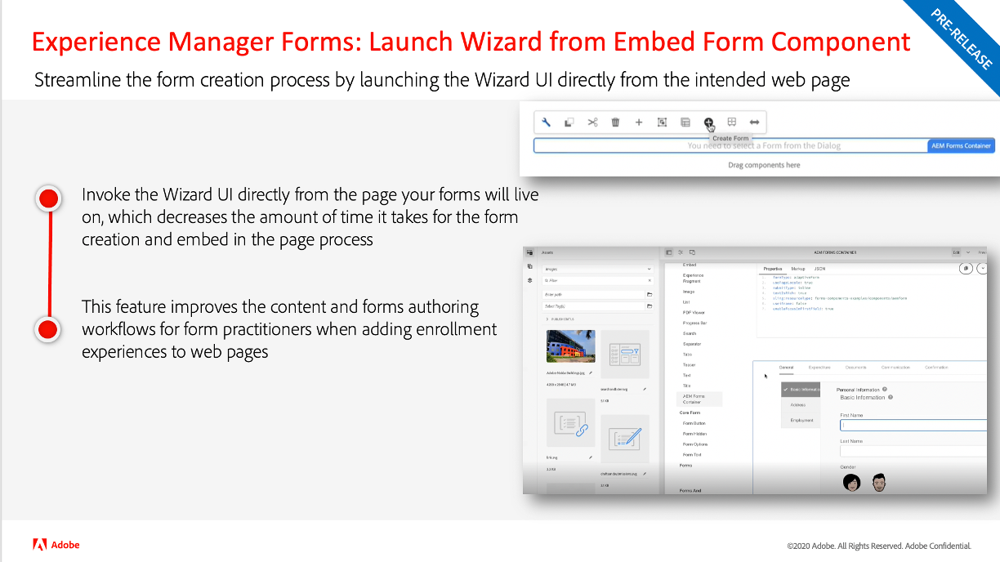
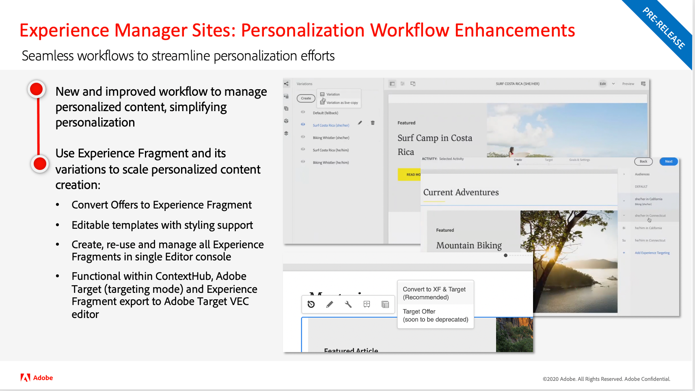

# Aggiornamenti della versione di Adobe Experience Manager as a Cloud Service

Veloce panoramica delle funzioni più recenti di Adobe Experience Manager as a Cloud Service. Si tratta di brevi video di circa 10 minuti forniti dal team di prodotto AEM, per presentare gli aspetti salienti dell’ultima versione.

## Ultimo aggiornamento

<table style="max-width: 50%;">
  <tr>
    <td>
      
      

        <a href="2023/2023-8-0.md">
          <strong>Versione | 2023.8.0</strong>
           
        </a>
          <em>Data di rilascio: agosto 2023 </em>
      

      

        <a href="https://experienceleague.adobe.com/docs/experience-manager-cloud-service/content/release-notes/release-notes/release-notes-current.html?lang=it">Note sulla versione</a>
      

    </td>
  </tr>  
</table>

## Aggiornamenti precedenti

<table style="max-width: 50%;">
  <tr>
    <td>
      
      

        <a href="2023/2023-7-0.md">
          <strong>Versione | 2023.7.0</strong>
           
        </a>
          <em>Data di rilascio: luglio 2023 </em>
      

      

        <a href="https://experienceleague.adobe.com/docs/experience-manager-cloud-service/content/release-notes/release-notes/release-notes-current.html?lang=it">Note sulla versione</a>
      

    </td>
    <td>
      
      

        <a href="2023/2023-6-0.md">
          <strong>Versione | 2023.6.0</strong>
           
        </a>
          <em>Data di rilascio: giugno 2023 </em>
      

      

        <a href="https://experienceleague.adobe.com/docs/experience-manager-cloud-service/content/release-notes/release-notes/release-notes-current.html?lang=it">Note sulla versione</a>
      

    </td>
    <td>
      
      

        <a href="2023/2023-4-0.md">
          <strong>Versione | 2023.4.0</strong>
           
        </a>
          <em>Data di rilascio: aprile 2023 </em>
      

      

        <a href="https://experienceleague.adobe.com/docs/experience-manager-cloud-service/content/release-notes/release-notes/release-notes-current.html?lang=it">Note sulla versione</a>
      

    </td>
    </tr>
    <tr>
    <td>
      
      

        <a href="2023/2023-2-0.md">
          <strong>Versione | 2023.2.0</strong>
           
          </a>
          <em>Data di rilascio: marzo 2023</em>
      

      

        <a href="https://experienceleague.adobe.com/docs/experience-manager-cloud-service/content/release-notes/release-notes/release-notes-current.html?lang=it">Note sulla versione</a>
      

    </td>
    <td>
      
      

        <a href="2023/2023-1-0.md">
          <strong>Versione | 2023.1.0</strong>
           
        </a>
          <em>Data di rilascio: febbraio 2023</em>
      

      

        <a href="https://experienceleague.adobe.com/docs/experience-manager-cloud-service/content/release-notes/release-notes/release-notes-current.html?lang=it">Note sulla versione</a>
      

    </td>
    <td>
      
      

        <a href="2022/2022-10-0.md">
          <strong>Versione | 2022.10.0</strong>
           
        </a>
          <em>Data di rilascio 13 ottobre 2022</em>
      

      

        <a href="https://experienceleague.adobe.com/docs/experience-manager-cloud-service/content/release-notes/release-notes/release-notes-current.html?lang=it">Note sulla versione</a>
      

    </td>
    </tr>
    <tr>
    <td>
      
      

        <a href="2022/2022-8-0.md">
          <strong>Versione | 2022.8.0</strong>
           
        </a>
          <em>Data di rilascio: 1 settembre 2022</em>
      

      

        <a href="https://experienceleague.adobe.com/docs/experience-manager-cloud-service/content/release-notes/release-notes/release-notes-current.html?lang=it">Note sulla versione</a>
      

    </td>
    <td>
      
      

        <a href="2022/2022-7-0.md">
          <strong>Versione | 2022.7.0</strong>
           
        </a>
          <em>Data di rilascio: 8 agosto 2022 </em>
      

      

        <a href="https://experienceleague.adobe.com/docs/experience-manager-cloud-service/content/release-notes/release-notes/release-notes-current.html?lang=it">Note sulla versione</a>
      

    </td>
    <td>
      
      

        <a href="2022/2022-6-0.md">
          <strong>Versione | 2022.6.0</strong>
         
      </a>
        <em>Data di rilascio: 30 giugno 2022 </em>
      

      

        <a href="https://experienceleague.adobe.com/docs/experience-manager-cloud-service/content/release-notes/release-notes/release-notes-current.html?lang=it">Note sulla versione</a>
      

    </td>
  </tr>
</table>