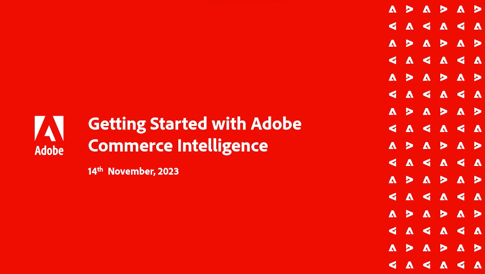

# Webinar di Adobe Commerce Intelligence

>[!NOTE]
>
>Adobe Commerce Intelligence era precedentemente nota come [!DNL Magento Business Intelligence (MBI)]. Le registrazioni per gli eventi passati riflettono il nome precedente.

La serie di webinar Commerce Intelligence è un evento periodico per i clienti Commerce Intelligence. I webinar trattano un’ampia gamma di argomenti e best practice per utilizzare al massimo le potenzialità di Commerce Intelligence.

Partecipanti da tutte le aree geografiche possono partecipare agli eventi in diretta per comprendere meglio il prodotto e ottenere risposte dirette alle loro domande sulla funzionalità Commerce Intelligence.

Gli argomenti vengono ripetuti occasionalmente per soddisfare eventuali nuove domande poste dai clienti.

## Proposte del nostro staff

<table>
<tr>
  <td>
    
     

      <a href="https://experienceleague.adobe.com/docs/events/commerce-intelligence-webinar-recordings/2023/getting-started.html">
        <strong>Guida introduttiva di Commerce Intelligence</strong>
      </a>
    

    

    <em>Scopri le funzionalità di base di Commerce Intelligence direttamente dal team di prodotto, con un approfondimento delle dashboard preconfigurate e delle opzioni di personalizzazione disponibili.</em>
    

  </td>
  <td>
    
     

      <a href="https://experienceleague.adobe.com/docs/events/commerce-intelligence-webinar-recordings/2023/manage-data-sets.html">
        <strong>Gestione dei set di dati in MBI</strong>
      </a>
    

    

    <em>Scopri alcune delle potenti funzionalità di MBI Data Warehouse Manager direttamente dal team di prodotto di Adobe Commerce. Vai oltre la creazione di rapporti di base e scopri come fare di più con i tuoi dati.</em>
    

  </td>
   <td>
    
     

      <a href="https://experienceleague.adobe.com/docs/events/commerce-intelligence-webinar-recordings/2021/optimize-data-warehouse.html">
        <strong>Ottimizzazione della Data Warehouse di MBI</strong>
      </a>
    

    

    <em>Tramite Gestione Date Warehouse è possibile gestire le impostazioni di sincronizzazione di tabelle e colonne, analizzare in profondità lo schema di una tabella e creare colonne calcolate da utilizzare nei report.</em>
    

  </td>
</tr>
</table>

>[!TIP]
>
>**Tutti i webinar registrati sono elencati nella barra di navigazione a sinistra**.

## Risorse utili

- [Video ed esercitazioni di Commerce Intelligence](https://experienceleague.adobe.com/docs/commerce-learn/tutorials/mbi/filter-sets.html)
- [Guida utente di Commerce Intelligence](https://experienceleague.adobe.com/docs/commerce-business-intelligence/mbi/guide-overview.html?lang=it)
