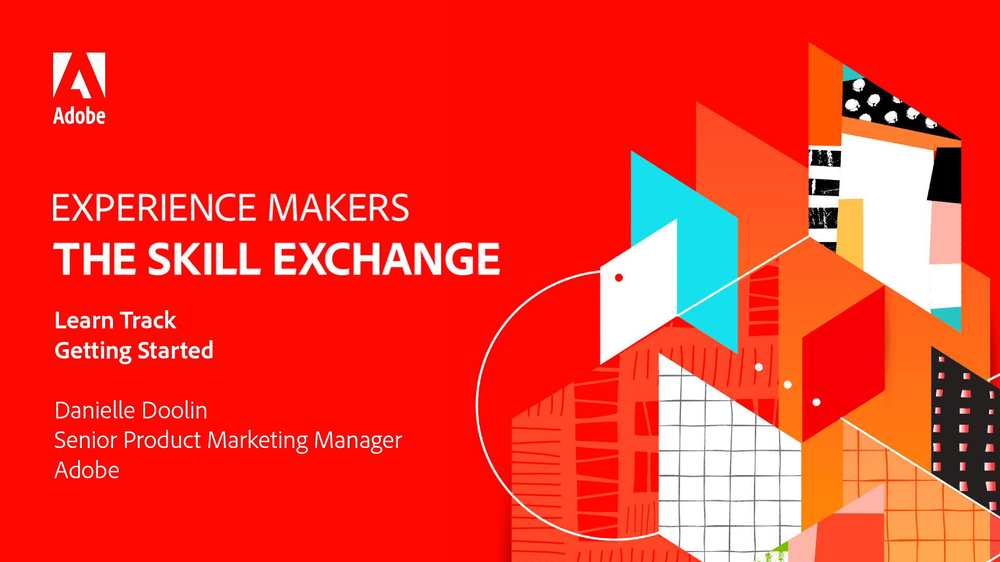

# Experience Makers The Skill Exchange {#overview}

Experience Makers The Skill Exchange è una serie globale di eventi di apprendimento virtuale per i clienti, incentrati sull&#39;approfondimento delle soluzioni Adobe Experience Cloud. Questo programma offre l’opportunità di imparare dagli esperti dei prodotti Adobe e da colleghi esperti attraverso la condivisione di best practice e suggerimenti.

>[!TIP]
>
>**Tutte le sessioni registrate sono elencate nella barra di navigazione a sinistra**.

## Sessioni in primo piano

<table>
  <tr>
   <td>
      
      

         <a href="analytics/jun2021/getting-started.md"><strong>Guida introduttiva di Adobe Analytics</strong></a>
<!---          <em>foo</em> -->
      

      

         
         Acquisisci familiarità con l’interfaccia utente di base di Analytics e avvia il tuo primo progetto in Analysis Workspace.
      

    </td>
   <td>
      
      

         <a href="marketo/feb2022/data-maintenance.md"><strong>Manutenzione dati</strong></a>
<!---          <em>foo</em> -->
      

      

         
         Metodologie facili da adottare per mantenere pulite le risorse più importanti.
      

    </td>
   <td>
      
      

         <a href="workfront/apr2022/ten-tips.md"><strong>10 suggerimenti per il Workfront</strong></a>
<!---          <em>foo</em> -->
      

      

         
         Questi suggerimenti sono rivolti agli amministratori che sono stati nella loro istanza per un po' di tempo e sperano in un modo più efficiente di fare le cose.
      

    </td>
  </tr>
</table>
