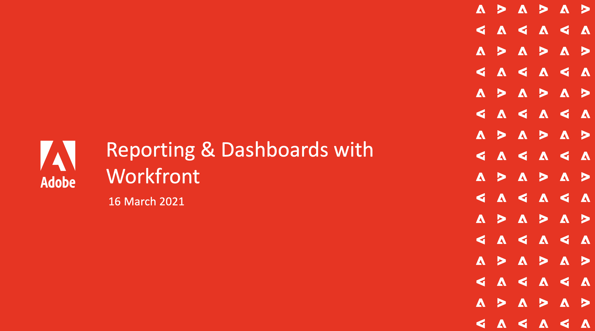

# Eventi Workfront On-Demand {#overview}

Una libreria di eventi Workfront registrati in cui esperti e colleghi condividono opinioni su come utilizzare Workfront.

## Sessioni in primo piano

<table>
  <tr>
   <td>
      
      

         <a href="user-groups/workfront-system-maintenance.md"><strong>Manutenzione del sistema Workfront</strong></a>
<!----          <em>foo</em> --->
      

      

         
         Un pannello di amministratori di sistema discute gli aspetti da considerare per la configurazione del sistema, la manutenzione regolare e la pulizia.
      

    </td>
   <td>
      
      

         <a href="user-groups/reporting-and-dashboards.md"><strong>Reporting e dashboard</strong></a>
<!----          <em>foo</em> --->
      

      

         
         Vedi i rapporti e le dashboard creati da altri utenti per le loro organizzazioni e le best practice che hanno imparato.
      

    </td>
   <td>
      
      

         <a href="user-groups/agile-in-marketing.md"><strong>Agile nel marketing</strong></a>
<!----          <em>foo</em> --->
      

      

         
         Gli esperti di Agile discutono i punti alti e le tendenze che hanno visto con agilità, agilità generale nel business, e come utilizzano Workfront per agile.
      

    </td>
  </tr>
</table>
